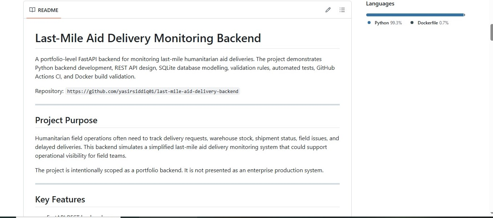
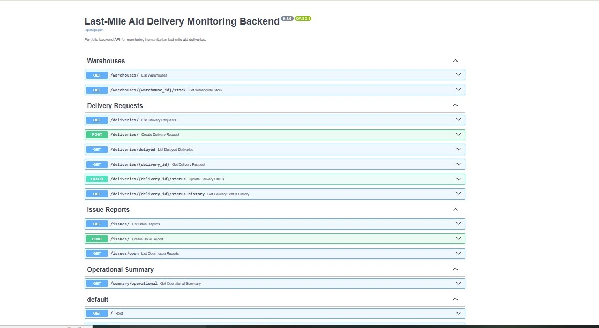
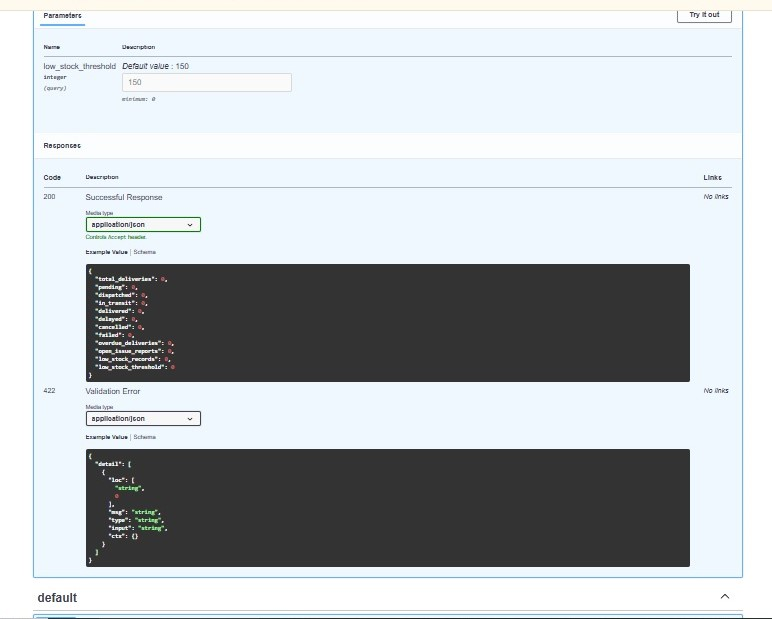

# Last-Mile Aid Delivery Monitoring Backend

A portfolio-level FastAPI backend for monitoring last-mile humanitarian aid deliveries.
The project demonstrates Python backend development, REST API design, SQLite database modelling, validation rules, automated tests, GitHub Actions CI, and Docker build validation.

Repository: `https://github.com/yasirsiddiq01/last-mile-aid-delivery-backend`

---

## Project Purpose

Humanitarian field operations often need to track delivery requests, warehouse stock, shipment status, field issues, and delayed deliveries. This backend simulates a simplified last-mile aid delivery monitoring system that could support operational visibility for field teams.

The project is intentionally scoped as a portfolio backend. It is not presented as an enterprise production system.

---

## Key Features

* FastAPI REST backend
* SQLite database with SQLAlchemy models
* Warehouse, location, partner, inventory, delivery, status history, and issue report entities
* Seed data for realistic humanitarian logistics scenarios
* Delivery request creation with stock reservation
* Business validation rules
* Shipment status transition logic
* Delayed delivery monitoring
* Issue reporting linked to valid deliveries
* Operational summary endpoint
* Pytest API tests
* GitHub Actions test workflow
* Dockerfile and docker-compose configuration
* Online Docker build and container validation through GitHub Actions CI

---

## Tech Stack

| Area             | Technology                   |
| ---------------- | ---------------------------- |
| Backend API      | FastAPI                      |
| Language         | Python                       |
| Database         | SQLite                       |
| ORM              | SQLAlchemy                   |
| Validation       | Pydantic                     |
| Testing          | Pytest, FastAPI TestClient   |
| CI/CD            | GitHub Actions               |
| Containerization | Dockerfile, docker-compose   |
| Documentation    | Markdown, FastAPI Swagger UI |

---

## Main Domain Entities

* Warehouses
* Field locations
* Delivery partners
* Inventory items
* Warehouse stock
* Delivery requests
* Shipment status history
* Issue reports

---

## Business Rules Implemented

| Rule                                                | Implementation                                            |
| --------------------------------------------------- | --------------------------------------------------------- |
| Cannot request more stock than available            | Delivery creation checks warehouse stock before reserving |
| Delivery date cannot be before request date         | Pydantic validation in delivery request schema            |
| Invalid warehouse/location/item/partner should fail | Reference validation before delivery creation             |
| Cancelled/failed/delivered statuses are terminal    | Status transition validation                              |
| Invalid status rollback should fail                 | Status transition rules block invalid movement            |
| Issue reports must link to valid deliveries         | Issue creation checks delivery request exists             |
| Delayed deliveries should be visible                | Delayed endpoint checks overdue active deliveries         |

---

## API Endpoints

| Method | Endpoint                                   | Purpose                                   |
| ------ | ------------------------------------------ | ----------------------------------------- |
| GET    | `/health`                                  | Basic API health check                    |
| GET    | `/db-health`                               | Database connection check                 |
| GET    | `/schema-health`                           | Database schema/table check               |
| GET    | `/data-health`                             | Seeded data count check                   |
| GET    | `/warehouses/`                             | List warehouses                           |
| GET    | `/warehouses/{warehouse_id}/stock`         | View warehouse stock                      |
| POST   | `/deliveries/`                             | Create delivery request and reserve stock |
| GET    | `/deliveries/`                             | List delivery requests                    |
| GET    | `/deliveries/delayed`                      | List overdue active deliveries            |
| GET    | `/deliveries/{delivery_id}`                | View a delivery request                   |
| PATCH  | `/deliveries/{delivery_id}/status`         | Update delivery status                    |
| GET    | `/deliveries/{delivery_id}/status-history` | View delivery status history              |
| POST   | `/issues/`                                 | Create issue report                       |
| GET    | `/issues/`                                 | List issue reports                        |
| GET    | `/issues/open`                             | List unresolved issue reports             |
| GET    | `/summary/operational`                     | Operational summary metrics               |

---

## Local Setup

### 1. Create and activate virtual environment

```bash
python -m venv .venv
```

Windows:

```bash
.venv\Scripts\activate.bat
```

### 2. Install dependencies

```bash
pip install -r requirements.txt
```

### 3. Start the API

```bash
uvicorn app.main:app --reload
```

Open:

```text
http://127.0.0.1:8000/docs
```

---

## Seed Data

Run:

```bash
python -m app.seed_data
```

Then check:

```text
http://127.0.0.1:8000/data-health
```

Expected seeded data includes warehouses, field locations, delivery partners, inventory items, and warehouse stock records.

---

## Running Tests

Run:

```bash
pytest
```

Current local result:

```text
7 passed
```

The test suite covers:

* Health endpoint
* Delivery request creation
* Stock reservation
* Over-stock validation
* Invalid status transition validation
* Invalid issue report delivery reference
* Operational summary counts

---

## GitHub Actions CI

This repository includes two GitHub Actions workflows:

| Workflow                | Purpose                                                                                               |
| ----------------------- | ----------------------------------------------------------------------------------------------------- |
| Python API Tests        | Installs dependencies and runs pytest                                                                 |
| Docker Build Validation | Builds Docker image, starts API container, checks health endpoint, seeds database, checks seeded data |

Both workflows have been validated through GitHub Actions.

---

## Docker

Docker configuration is included:

```text
Dockerfile
docker-compose.yml
.dockerignore
```

Docker Desktop could not be validated locally because of limited C: drive space on the development machine. Instead, Docker build and container execution were validated online through GitHub Actions CI.

This is the accurate Docker claim for this project:

```text
Dockerfile and docker-compose configuration validated through GitHub Actions CI.
```

---

## Example Operational Summary

Example endpoint:

```text
GET /summary/operational
```

Example response:

```json
{
  "total_deliveries": 2,
  "pending": 1,
  "dispatched": 0,
  "in_transit": 1,
  "delivered": 0,
  "delayed": 0,
  "cancelled": 0,
  "failed": 0,
  "overdue_deliveries": 1,
  "open_issue_reports": 1,
  "low_stock_records": 1,
  "low_stock_threshold": 150
}
```

---

## Screenshots

### GitHub Repository Main Page



### GitHub Actions Passed


### FastAPI Swagger Documentation



### Operational Summary Response



---

## Known Limitations

This project is intentionally scoped as a portfolio backend.

Current limitations:

* SQLite is used first for simplicity; PostgreSQL is not yet implemented.
* Authentication and role-based access control are not implemented yet.
* No Kubernetes deployment is included.
* No real humanitarian data is used.
* No production cloud deployment is claimed.
* The dashboard layer is not yet implemented.
* Migrations are basic through SQLAlchemy table creation; Alembic is not yet added.

---

## Suitable CV Description

Built a FastAPI backend for last-mile humanitarian aid delivery monitoring, including SQLite/SQLAlchemy data models, REST APIs, stock validation, shipment status transitions, issue reporting, delayed delivery monitoring, operational summary metrics, pytest coverage, GitHub Actions CI, and Docker build validation through online CI.

---

## Interview Explanation

This project simulates how a humanitarian operations team could monitor aid deliveries from warehouses to field locations. The backend supports delivery creation, stock reservation, status tracking, issue reporting, delayed delivery detection, and operational summaries.

The main engineering focus was backend correctness rather than UI design. I implemented validation rules such as preventing requests that exceed available stock, blocking invalid status transitions, and ensuring issue reports are linked to valid deliveries. I also added automated pytest tests and GitHub Actions workflows to show CI readiness. Docker configuration is included and validated through GitHub Actions because local Docker Desktop validation was limited by machine disk-space constraints.
